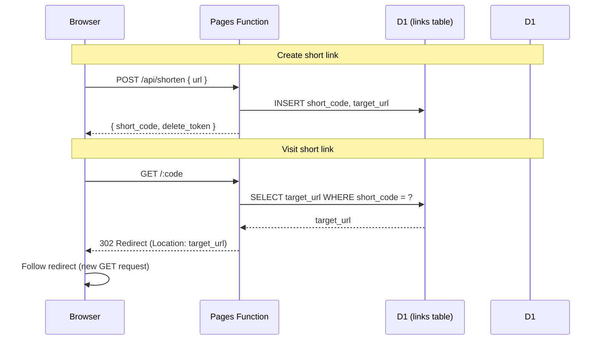
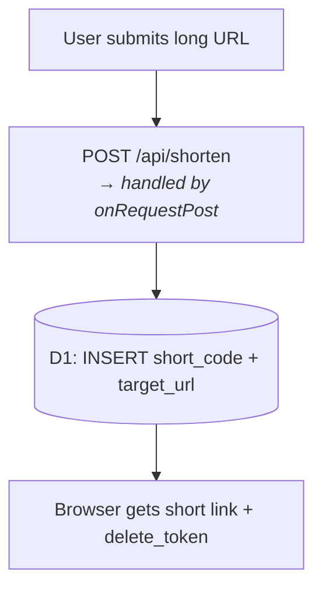
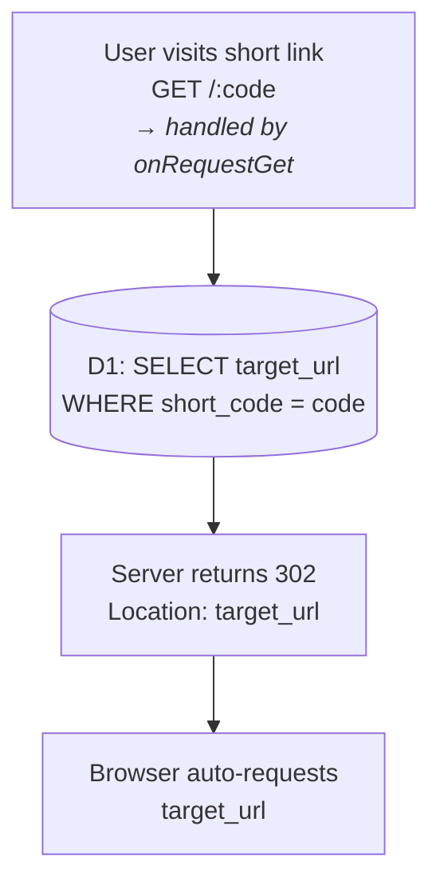

# URL Shortener (Cloudflare Practice)

A small practice project for exploring Cloudflare's platform features (Pages, Pages Functions, D1).
The app itself is a simple URL shortener — paste a long URL and get back a short link.

## Cloudflare setup

1. **Create the Pages project.** In the Cloudflare dashboard: Workers & Pages → Create → Pages →
   Connect to Git → GitHub, and pick this repository. Build command `npm run build`, output
   directory `dist`. Every push to `main` deploys from then on.

2. **Create the D1 database.**

   ```sh
   npx wrangler d1 create shortlink-db
   ```

   That prints a config snippet containing the new `database_id` — the value in the
   `[[d1_databases]]` block of `wrangler.toml` comes from there. The snippet's `binding` defaults to
   the database name; here it is `DB`, the name the Functions read as `env.DB`.

3. **Apply the schema to the remote database.** Run the contents of `schema.sql` in the dashboard's
   D1 Console, or from the CLI:

   ```sh
   npx wrangler d1 execute shortlink-db --remote --file=schema.sql
   ```

   Until the `links` table exists, `POST /api/shorten` fails on the deployed site. A column added
   after the table already holds rows goes in one at a time instead:

   ```sql
   ALTER TABLE links ADD COLUMN deleted_at TEXT;
   ```

   (That is how `deleted_at` and `delete_token` arrived, so a live database's column order can
   differ from `schema.sql` while staying equivalent.)

## Running locally

`wrangler pages dev` serves the built `dist/` folder, so `npm run build` has to run first either way.
The local D1 database needs the schema once:

```sh
npx wrangler d1 execute shortlink-db --local --file=schema.sql
```

**Working on the frontend** — two processes:

```sh
npx wrangler pages dev dist   # :8788 — Functions + D1
npm run dev                   # :5173 — Vite with HMR, proxies /api/* to :8788
```

Open <http://localhost:5173>. The proxy only forwards `/api/*`, so anything that hits `/:code` —
following a short link from the history list, deleting one — has to be exercised on :8788. On :5173
those requests reach Vite instead, which answers with the SPA.

**Everything else** — one process:

```sh
npm run build
npx wrangler pages dev dist
```

Open <http://localhost:8788>. Static responses come from Cloudflare's asset handling here, so this is
the only local setup where `_headers` and the `exclude` list in `_routes.json` have any effect — on
:5173 those responses come from Vite.

## Pages Functions routing

Cloudflare Pages Functions map routes using two conventions, both handled by the Cloudflare
runtime itself — nothing in this repo configures them explicitly:

1. **File path → URL route.** The file's path under `functions/` becomes the route. `[code]` is
   dynamic-segment syntax (like Vue Router's `:code`) — it matches any single path segment, and
   the matched value is parsed out for you.
2. **Exported function name → HTTP method.** Within a file, Cloudflare looks for specifically-named
   exports.

| File | Route |
| --- | --- |
| `functions/[code].js` | `/:code` |
| `functions/api/shorten.js` | `/api/shorten` |

| Export name | HTTP method |
| --- | --- |
| `onRequestGet` | GET |
| `onRequestPost` | POST |
| `onRequestDelete` | DELETE |
| `onRequest` | any method (catch-all) |

Static routes (like `/api/shorten`) take priority over dynamic ones (like `/:code`), so a request
to `/api/shorten` is never mistaken for `[code].js` with `code = "api"`.

### Frontend calls → which handler runs

The frontend never registers routes itself — it just calls a URL with `fetch` and a given HTTP
`method`. Cloudflare matches that (URL, method) pair to the right file/export using the rules
above.

| Frontend call | URL + method | Matches |
| --- | --- | --- |
| `onSubmit()` ([HomeView.vue](src/views/HomeView.vue)) | `fetch('/api/shorten', { method: 'POST' })` | `functions/api/shorten.js` → `onRequestPost` |
| `deleteLinkOnServer()` ([useHistory.ts](src/composables/useHistory.ts)) | `` fetch(`/${shortCode}`, { method: 'DELETE' }) `` — e.g. `shortCode = "abc123"` actually requests `fetch('/abc123', { method: 'DELETE' })` | `functions/[code].js` → `onRequestDelete` |

### Where the dynamic segment ends up: `context.params`

When a request matches a dynamic route like `/:code`, Cloudflare parses the matched segment out
of the URL and passes it into the handler via `context.params` — the frontend never sends this
separately, it's extracted from the URL itself:

```js
// functions/[code].js
export async function onRequestDelete(context) {
  const { params, env, request } = context;
  const code = params.code; // "abc123", parsed from the request URL /abc123
  // ...
}
```

`context` is the object Cloudflare automatically builds for every request; besides `params`, it
also carries `request` (the raw `Request`, e.g. for reading the JSON body) and `env` (bindings
such as `env.DB`).

## Redirect flow

How a short link is created, and how visiting it later resolves back to the original URL:



Same logic, split into two separate step-by-step flowcharts:

### 1. Creating a short link



### 2. Visiting a short link


